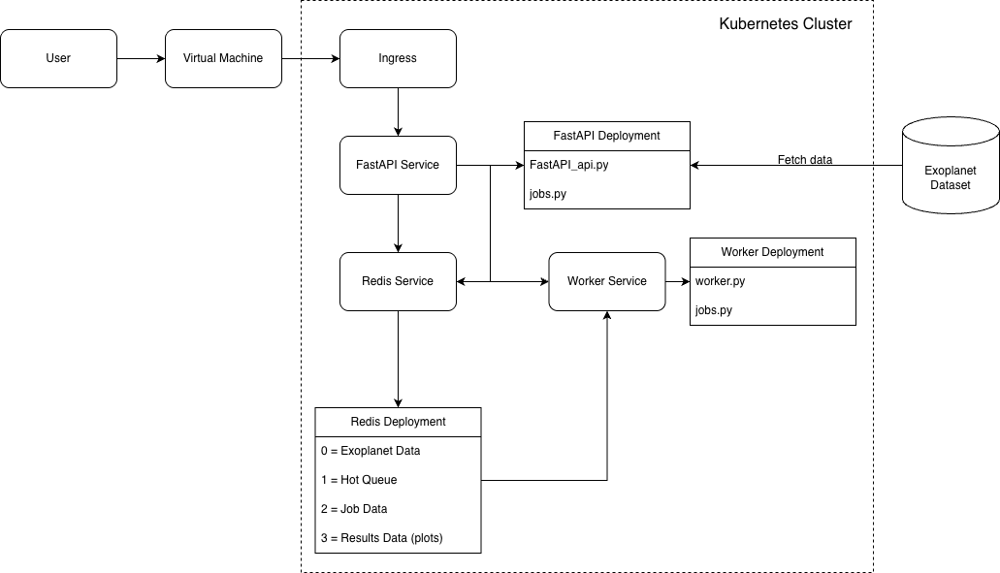
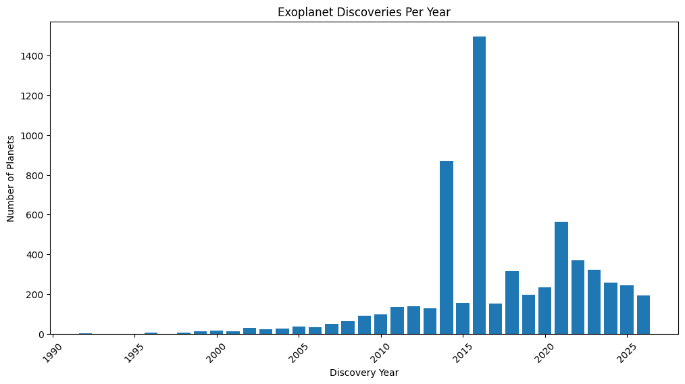
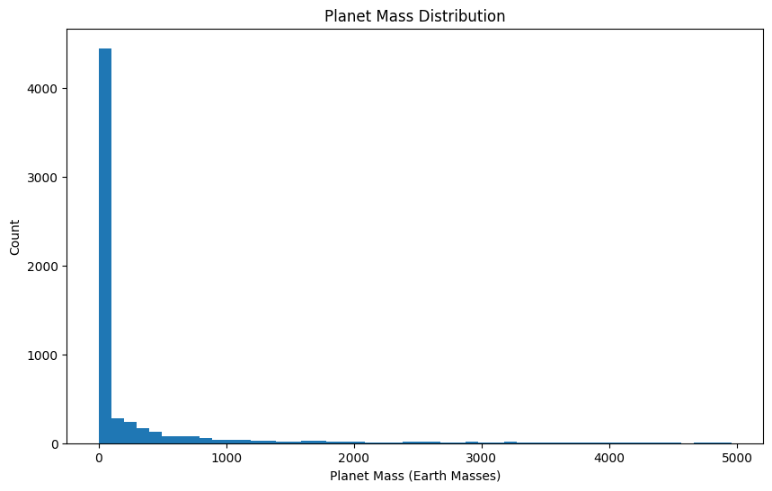
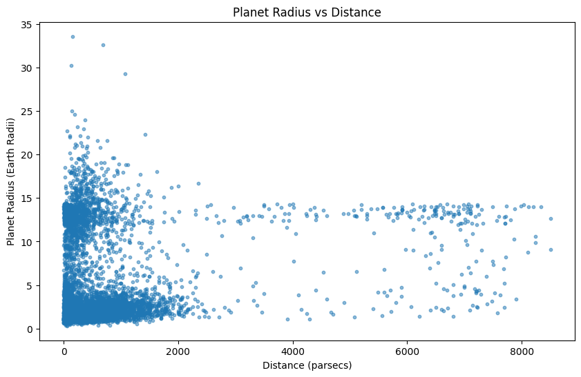

# NASA Exoplanet Dataset Analysis with FastAPI, Redis, and Kubernetes

This directory contains Python scripts that read NASA Exoplanet Archive data and display exoplanet information. We use FastAPI, Redis services, and a worker to create asynchronous analysis jobs. In addition, we generate visualizations, use logging, and include tests.

## File Descriptions
- [src/FastAPI_api.py](src/FastAPI_api.py): Main file containing the FastAPI web server and Redis database queries

- [src/worker.py](src/worker.py): Contains code to execute asynchronous analysis jobs and generate plots

- [src/jobs.py](src/jobs.py): File containing core functionality for working with jobs in Redis and on the queue

- [test/test_api.py](test/test_api.py): Tests for FastAPI routes

- [test/test_worker.py](test/test_worker.py): Tests for worker.py

- [test/test_jobs.py](test/test_jobs.py): Tests for jobs.py

- [docker-compose.yml](docker-compose.yml): Manages FastAPI container, worker container, and Redis database container

- [Dockerfile](Dockerfile): Dockerfile containing build steps and installs dependencies for the FastAPI application

- [kubernetes/](kubernetes/): Contains test and production Kubernetes deployment files

## NASA Exoplanet Data Description
The dataset comes from the NASA Exoplanet Archive and can be accessed at:

https://exoplanetarchive.ipac.caltech.edu/

This project uses the Planetary Systems Composite Parameters table, also called PSCompPars. The dataset includes information such as:

- Planet name
- Host star name
- Number of stars in the system
- Number of planets in the system
- Discovery year
- Orbital period
- Planet radius in Earth radii
- Planet mass in Earth masses
- Orbital eccentricity
- Distance from Earth in parsecs

## Software Diagram
Below is the software diagram for this web app. We can see that the application is containerized using Docker and how FastAPI interacts with the worker and Redis database. First, the user sends a request to the app through the NodePort (coe332.tacc.cloud:31294) or Ingress URL. FastAPI handles requests and reads/writes data to Redis DB 0. The user then creates jobs which are stored in Redis DB 1. The worker pulls jobs from Redis DB1, processes them, and saves results in Redis DB 3. Then, the user can download the results through the results endpoint.

## Set up Docker
Before starting, ensure you have Docker and Kubernetes installed.

### Build the Image
To build the image, run the following command:

`docker compose build`

## How to Run Locally
After building the image, start the FastAPI, worker, and Redis containers:

`docker compose up -d`

Note: If you already have a container named "/api", you may need to run:

`docker rm -f api`

The local API can be accessed at:

`http://localhost:8000`

## Kubernetes Deployment
This project includes Kubernetes configuration files for both test and production environments. The application includes a Redis deployment, FastAPI deployment, worker deployment, Redis service, FastAPI service, NodePort service, Ingress, and Redis persistent volume claim.

### Deploy Test Environment
Run:

`kubectl apply -f kubernetes/test/`

Check that all pods, services, and ingress objects are running:

`kubectl get pods`

`kubectl get services`

`kubectl get ingress`

### Deploy Production Environment
Run:

`kubectl apply -f kubernetes/prod/`

Check deployment status:

`kubectl get pods`

`kubectl get services`

`kubectl get ingress`

### Kubernetes Access
The application can be accessed through the NodePort service:

`http://coe332.tacc.cloud:31294`

The application can also be accessed through the Ingress URL:

`http://christinegoh.coe332.tacc.cloud`

## Output
We will use `curl` to interact with the FastAPI microservice. Below are the following routes.

### <u>Routes</u>

### /help
   - Method: GET
   - Return all API routes and descriptions
   - `curl coe332.tacc.cloud:31294/help`

### /data
   - Method: POST
   - Put NASA exoplanet data into Redis
   - `curl coe332.tacc.cloud:31294/data -X POST`
   - Expected output:
   ~~~
   "Loaded NASA exoplanet data into Redis successfully"
   ~~~

### /data
   - Method: GET
   - Return all data from Redis
   - `curl coe332.tacc.cloud:31294/data`
   - Expected output:
   ~~~
   [{"planet_name":"Kepler-10 b","hostname":"Kepler-10","num_stars":1,"num_planets":2,"disc_year":2011,"orbital_period":0.8374907,"planet_rad":1.47,"planet_mass":3.72,"orb_eccentricity":0.0,"distance":186.5}, ...]
   ~~~

### /data
   - Method: DELETE
   - Delete data in Redis
   - `curl coe332.tacc.cloud:31294/data -X DELETE`
   - Expected output:
   ~~~
   "Data deleted successfully"
   ~~~

### /planets
   - Method: GET
   - Return JSON-formatted list of all planet names
   - `curl coe332.tacc.cloud:31294/planets`
   - Expected output:
   ~~~
   ["Kepler-10 b","Kepler-10 c","TRAPPIST-1 b", ...]
   ~~~

### /planets/<planet_name>
   - Method: GET
   - Return all data associated with <planet_name>
   - Planet names with spaces should use `%20`
   - `curl coe332.tacc.cloud:31294/planets/Kepler-10%20b`
   - Expected output:
   ~~~
   {"planet_name":"Kepler-10 b","hostname":"Kepler-10","num_stars":1,"num_planets":2,"disc_year":2011,"orbital_period":0.8374907,"planet_rad":1.47,"planet_mass":3.72,"orb_eccentricity":0.0,"distance":186.5}
   ~~~

### /planets/discovery-year/<year>
   - Method: GET
   - Return all planets discovered in a given year
   - `curl coe332.tacc.cloud:31294/planets/discovery-year/2015`

### /planets/host/<hostname>
   - Method: GET
   - Return all planets associated with a host star
   - `curl coe332.tacc.cloud:31294/planets/host/Kepler-10`

### /planets/distance/<min_distance>/<max_distance>
   - Method: GET
   - Return all planets within a distance range
   - `curl coe332.tacc.cloud:31294/planets/distance/0/100`

### /jobs
   - Method: POST
   - Post job request into Redis database
   - Available plot types:
     - `discoveries_per_year`
     - `mass_distribution`
     - `radius_vs_distance`
   - `curl coe332.tacc.cloud:31294/jobs -X POST -d '{"plot_type":"discoveries_per_year"}' -H "Content-Type: application/json"`
   - Expected output:
   ~~~
   {"message":"Job created successfully","job":{"jid":"8371a51f-c29f-4959-b7b6-7bfa51a8b701","status":"QUEUED","plot_type":"discoveries_per_year","start":null,"end":null,"start_time":null,"end_time":null}}
   ~~~

### /jobs
   - Method: GET
   - Return all current and past jobs from Redis database
   - `curl coe332.tacc.cloud:31294/jobs`
   - Expected output:
   ~~~
   ["8371a51f-c29f-4959-b7b6-7bfa51a8b701", ...]
   ~~~

### /jobs/<jobid>
   - Method: GET
   - Return specific job provided a job id
   - `curl coe332.tacc.cloud:31294/jobs/8371a51f-c29f-4959-b7b6-7bfa51a8b701`
   - Expected output:
   ~~~
   {"jid":"8371a51f-c29f-4959-b7b6-7bfa51a8b701","status":"FINISHED -- SUCCESS","plot_type":"discoveries_per_year","start":null,"end":null,"start_time":"2026-04-30T15:16:46.466316","end_time":"2026-04-30T15:16:51.468371"}
   ~~~

### /results/<jobid>
   - Method: GET
   - Download the completed plot image for a job id
   - `curl coe332.tacc.cloud:31294/results/8371a51f-c29f-4959-b7b6-7bfa51a8b701 --output plot.png`
   - Expected output:
   ~~~
   A PNG image file named plot.png
   ~~~

## Analysis Jobs
The worker generates three different plots:

- Exoplanet discoveries per year
- Planet mass distribution
- Planet radius vs distance

Example job submissions:

`curl coe332.tacc.cloud:31294/jobs -X POST -d '{"plot_type":"discoveries_per_year"}' -H "Content-Type: application/json"`

`curl coe332.tacc.cloud:31294/jobs -X POST -d '{"plot_type":"mass_distribution"}' -H "Content-Type: application/json"`

`curl coe332.tacc.cloud:31294/jobs -X POST -d '{"plot_type":"radius_vs_distance"}' -H "Content-Type: application/json"`

Below are the plots for each of those jobs:
### Exoplanet Discoveries Per Year

### Planet Mass Distribution

### Radius vs Distance

## Redis Database
This project uses Redis to support:

- Raw data database: stores the NASA exoplanet dataset
- Hot queue: stores jobs waiting to be processed
- Jobs database: stores job instructions and statuses
- Results database: stores final PNG images generated by the workers

## Clean Up
Once you are finished running locally, stop the containers and remove them.

`docker compose down`

To clean up Kubernetes resources, run:

`kubectl delete -f kubernetes/test/`

or:

`kubectl delete -f kubernetes/prod/`

## Testing Script
The testing script ensures the calculations are correct and there is proper error handling. These tests depend on an existing API. Before running, ensure the API is already running.

Run all tests with:

`uv run pytest`

All tests should pass successfully.

## Notes
We had guidance from AI to help with plotting and debugging.